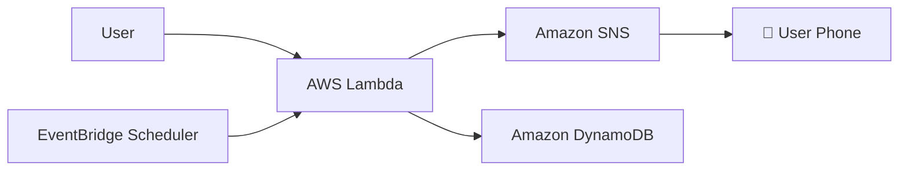

# 🚀 Amazon Price Tracker using AWS Services


## 📋 Project Overview

An automated price tracker system that monitors Amazon product prices and sends SMS alerts when the price drops below the user's target price. 100% Serverless - no server management required!

## 🎯 Features

- ✅ **Automated Price Checking** - Automatic price check every 2 minutes
- ✅ **SMS Notifications** - Instant SMS alert when price drops
- ✅ **AWS Serverless** - No server management required
- ✅ **Cost Effective** - Monthly cost approx ₹1.5 only
- ✅ **Scalable** - Can track multiple products

## 🏗️ Architecture Diagram




## 📦 AWS Services Used

| Service | Purpose | Cost (Monthly) |
|---------|---------|----------------|
| **AWS Lambda** | Executes price check logic | ~₹0.20 |
| **Amazon SNS** | Sends SMS notifications | ~₹1.00 |
| **EventBridge** | Handles automated scheduling	 | ~₹0.25 |
| **DynamoDB** | Stores products and preferences | ~₹0.25 |

---

# 🚀 Step-by-Step Implementation Guide

## 📋 Prerequisites


- ✅ AWS Account
- ✅ Verified Phone Number (+91 format)
- ✅ Basic Python Knowledge

---

## 🛠️ Step 1: Create AWS Lambda Function


### Detailed Steps:

1. **Go to AWS Console**
2. **Search for Lambda service**
   ```
   Services → Compute → Lambda
   ```
3. **"Click "Create function"**
   - Function name: `price-checker`
   - Runtime: Python 3.9
   - Architecture: x86_64

---

## 💻 Step 2: Lambda Code 


### Complete Lambda Code:

```python
import boto3
import urllib.request
import re

def lambda_handler(event, context):
    try:
        PRODUCT_URL = "https://amzn.in/d/bLxhjBN"
        TARGET_PRICE = 200000
        PHONE_NUMBER = "+919022604252"
        
        current_price = check_amazon_price(PRODUCT_URL)
        
        if current_price == 0:
            return {"status": "error", "message": "Price extract nahi ho paya"}
        
        if current_price <= TARGET_PRICE:
            savings = TARGET_PRICE - current_price
            message = f"🎉 PRICE DROP ALERT! 🎉\n\nProduct Price: ₹{current_price:,}\nTarget Price: ₹{TARGET_PRICE:,}\nYou Save: ₹{savings:,}\n\nBuy Now: {PRODUCT_URL}"
            sms_response = send_sms(PHONE_NUMBER, message)
            return {"status": "success", "message": "SMS sent!"}
        else:
            return {"status": "high_price", "message": "Price still high."}
            
    except Exception as e:
        return {"status": "error", "message": str(e)}

def check_amazon_price(url):
    headers = {'User-Agent': 'Mozilla/5.0 (Windows NT 10.0; Win64; x64)'}
    req = urllib.request.Request(url, headers=headers)
    response = urllib.request.urlopen(req, timeout=10)
    html_content = response.read().decode('utf-8', errors='ignore')
    return extract_price_advanced(html_content)

def extract_price_advanced(html):
    patterns = [r'₹\s*([\d,]+(?:\.\d{2})?)', r'"price":\s*(\d+(?:\.\d+)?)']
    for pattern in patterns:
        matches = re.findall(pattern, html)
        for match in matches:
            clean_price = str(match).replace(',', '')
            price = float(clean_price)
            if 100 < price < 1000000:
                return price
    return 0

def send_sms(phone_number, message):
    sns = boto3.client('sns')
    return sns.publish(PhoneNumber=phone_number, Message=message)
```

---

## 📱 Step 3: SNS Setup 

- Go to SNS service
- Add phone number (format: +91XXXXXXXXXX)
- OTP verify 


---

## 🔐 Step 4: Permissions Setup

- `AmazonSNSFullAccess` aur `CloudWatchLogsFullAccess` policies IAM Role mein attach karein

---

## ⏰ Step 5: Automation Setup

- EventBridge scheduler mein `rate(2 hours)` expression ke sath trigger set karein

---

## ⚙️ Step 6: Configuration Update Setup

- Timeout: 30 seconds
- Memory: 512 MB

---

## 🧪 Step 7: Testing & Monitoring

Test event create :
```json
{
  "test": "price_check"
}
```


Aur CloudWatch mein logs dekhein.

---
## 💰 Output:- 


## 💰 Cost Breakdown

| Service | Free Tier | Beyond Free Tier | Your Cost |
|---------|-----------|------------------|-----------|
| **Lambda** | 1M requests | $0.20 per 1M | ~₹0.20 |
| **SNS** | 1000 SMS | $0.80 per 100 SMS | ~₹1.00 |
| **EventBridge** | 14M events | $1.00 per 1M | ~₹0.25 |
| **DynamoDB** | 25GB storage | $0.25 per GB | ~₹0.25 |
| **Total** | **~₹0** | **Monthly** | **~₹1.70** |

---

## 🚀 Future Enhancements

- [ ] Web Interface
- [ ] Multiple Products Tracking
- [ ] Price History Charts
- [ ] Email Notifications
- [ ] Mobile App Integration

---

## 📞 Support & Resources

- 📚 [AWS Lambda Documentation](https://docs.aws.amazon.com/lambda/)
- 📚 [Amazon SNS Guide](https://docs.aws.amazon.com/sns/)

---
**✨ Your Amazon Price Tracker is Now Live! ✨**


